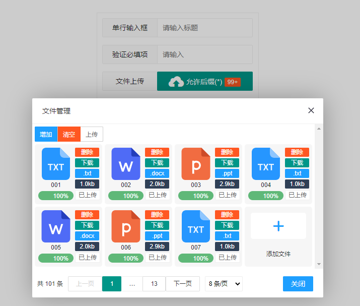
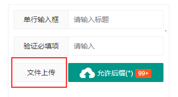
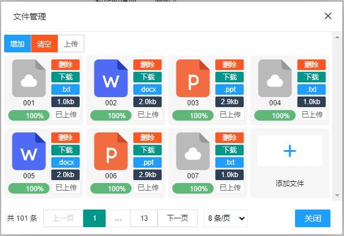
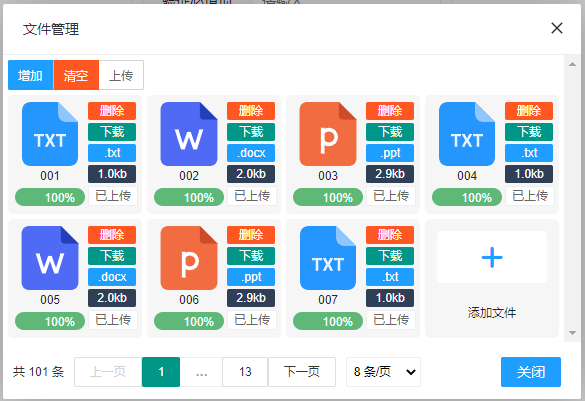
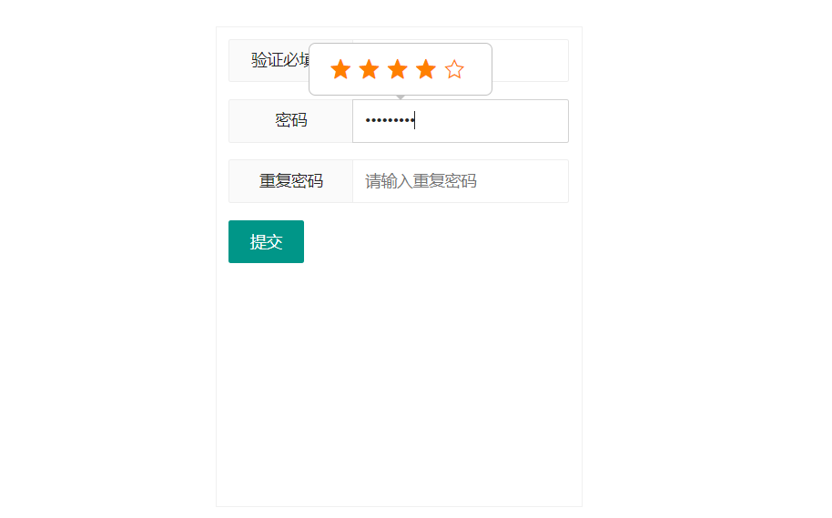

### Layui-Plugin

   

[预览所有组件](<http://candypop.gitee.io/layui-plugin>)

---

#### layui-uploadx

> 该插件是对原有layui-upload功能的扩展，用户可以自定义文件的上传路径、下载路径、删除路径等，原upload参数也可以完全支持，在原本的upload传入参数的时候，增加了ex和page参数用来定义uploadx插件的额外功能。该插件目前**必须**放置在表单中。

##### 使用案例

```html
<body>
		<form class="layui-form layui-form-pane" action="" style="width: 300px;height:400px;padding: 10px;border:1px solid #F0F0F0;margin: 40px auto;" lay-filter="example">
            <!-- 用来将某个表单对应的数据id填充到表单 -->
			 <input type="hidden" name="id" value="66" />
			 <div class="layui-form-item">
			    <label class="layui-form-label">单行输入框</label>
			    <div class="layui-input-block">
			      <input type="text" name="title" lay-verify="title" autocomplete="off" placeholder="请输入标题" class="layui-input">
			    </div>
			  </div>
			 <!-- 将对应的内容渲染成附件上传组件 -->
			  <div id="up"></div>
             <div id="up1"></div>
		</form>
</body>
<script type="text/javascript">
		layui.config({
			base: 'plugin/'
		}).use(['jquery', 'layer', 'uploadx','form'], function() {
			var $ = layui.jquery,
				uploadx = layui.uploadx,
				upload = layui.upload,
				form = layui.form;
			uploadx.render({
				ex:{
					elem:"#up",
					url:'./data/uploadx.json',//模拟请求
                    // #issue I48IA0
					biz:'biz1',//用于区别单个表单下若存在多个附件上传的功能，用于区别他们之间的内容。
					name:'文件上传',
					form:'example',
					mainId:'id'//默认也是这个名字
				},
                page:{
                    limit:8
                }//分页的参数
			});
            
            uploadx.render({
				ex:{
					elem:"#up1",
					url:'./data/uploadx2.json',//模拟请求
					biz:'biz2',//用于区别单个表单下若存在多个附件上传的功能，用于区别他们之间的内容。
					name:'文件上传2',
					title:'up2',
					form:'example',
					mainId:'id'//默认也是这个名字
				}
			});
		});
	</script>
```

##### 效果预览



##### 参数说明

原layui上传组件，分页组件的参数都可以全部使用，部分参数类似绑定id的html元素请不要随意设置，避免功能错乱。**参数属性加*则意味着此参数必填。**

```javascript
uploadx.render({
    ex:{
        //...
    }
});
```

| 参数选项     | 说明                                                         | 类型          | 默认值   |
| ------------ | ------------------------------------------------------------ | ------------- | -------- |
| elem         | 指向容器选择器，如：elem: '#id'。也可以是DOM对象             | string/object | -        |
| name         | 用于生成表单input元素时候的字段名称 | String        | 附件     |
| title        | 附件上传弹出框的标题                                         | String        | 文件管理 |
| **form***    | 表单属性设置的layui-filter的值，插件需要借用此属性获得id来请求后台数据 | String        | -        |
| **url***     | 请求附件数据进行显示的路径，组件将会自动将form属性获得的id填充进请求参数中，方便后台处理 | String        | -        |
| biz          | 用于在区别在同一个表单存在多个附件上传功能的功能，上传和请求都会携带此参数 | String        | -        |
| loadType     | 请求url属性的request method类型                              | String        | get      |
| mainId       | 对应的主键名是什么，这参数会影响请求时候，主键的参数名       | String        | id       |
| downId       | 对应的主键名是什么，这参数会影响下载时候，主键的参数名       | String        | id       |
| **downUrl*** | 下载附件的url                                                | String        | -        |
| **delUrl***  | 删除附件的url                                                | String        | -        |
| successCode  | 请求成功码，所有不是此码的请求，都被视失败。                 | int           | 200      |
| successName  | 请求成功码属性名称。                                         | String        | code     |
| resultName   | 请求结果属性名称。                                           | String        | result   |
| countName    | 请求附件总数的属性名称                                       | String        | count    |
| success      | 操作成功的回调 会根据返回成功码来执行 200 执行               | function      | -        |
| error        | 操作失败的回调  非200执行                                    | function      | -        |

```javascript
uploadx.render({
    page:{
        //... 原 layui 分页组件的参数都可以使用
    }
});
```

| 参数选项    | 说明                   | 类型   | 默认值 |
| ----------- | ---------------------- | ------ | ------ |
| limitName   | 获取limit的属性名称    | String | limit  |
| currentName | 获取当前页数的属性名称 | String | curr   |

##### 方法

> addExt(options)

```javascript
layui.config({
			base: 'plugin/'
		}).use(['jquery', 'layer', 'uploadx','form'], function() {
			var $ = layui.jquery,
				uploadx = layui.uploadx,
				form = layui.form;
    		// 添加 .txt类型的文件icon
			uploadx.addExt({
				ext:'txt',
				type:'svg',
				icon:'<svg t="1629904039173" class="icon" viewBox="0 0 1024 1024" version="1.1" xmlns="http://www.w3.org/2000/svg" p-id="1280" xmlns:xlink="http://www.w3.org/1999/xlink" width="64" height="64"><defs><style type="text/css"></style></defs><path d="M192 0h448.1536L960 320v576c0 70.6944-57.3056 128-128 128H192C121.3056 1024 64 966.6944 64 896V128C64 57.3056 121.3056 0 192 0z" fill="#2696FF" p-id="1281"></path><path d="M417.7536 546.176h-60.8256v170.5728h-40.9216V546.176H256V512h161.7536v34.176z m94.3872 36.416L549.376 512h47.0528l-57.8304 101.5296 59.328 103.2192h-47.6032l-38.1824-71.7184-38.1952 71.7184h-47.6032l59.3408-103.2192L427.8528 512h47.0528l37.2352 70.592zM768 546.176h-60.8256v170.5728H666.24V546.176h-60.0064V512H768v34.176z" fill="#FFFFFF" opacity=".9" p-id="1282"></path><path d="M640 0l320 320H768c-70.6944 0-128-57.3056-128-128V0z" fill="#8FC6FE" p-id="1283"></path></svg>'
			});
			
    
			uploadx.render({
				//...
			});
    		
    		// 添加 .json类型的文件icon
    		uploadx.addExt({
				ext:'json',
				type:'img',
				icon:'./icon/uploadx/javascript.png'
			});
    
});
```

此方法用于将还没有收录的**其他类型文件**自定义添加到组件中，可在，有更好的展示效果。icon目前支持两种类型，一个`svg`，另一个`img`；

**添加前**



**添加后**



#### layui-password

> 该插件引入后，将会为你所选择的表单，插入密码输入框和重复密码输入框

##### 使用案例

```html
<body>
		<form class="layui-form layui-form-pane" action="" style="width: 300px;height:400px;padding: 10px;border:1px solid #F0F0F0;margin: 40px auto;" lay-filter="example">
			  <div class="layui-form-item" id="next">
			    <label class="layui-form-label">验证必填项</label>
			    <div class="layui-input-block">
			      <input type="text" name="username" lay-verify="required" lay-reqtext="用户名是必填项，岂能为空？" placeholder="请输入" autocomplete="off" class="layui-input">
			    </div>
			  </div>
			  <div class="layui-form-item">
			      <button class="layui-btn" lay-submit="" lay-filter="demo2">提交</button>
			  </div>
		</form>
		<form class="layui-form layui-form-pane" action="" style="width: 300px;height:400px;padding: 10px;border:1px solid #F0F0F0;margin: 40px auto;" lay-filter="example0">
			  <div class="layui-form-item" id="next0">
			    <label class="layui-form-label">验证必填项</label>
			    <div class="layui-input-block">
			      <input type="text" name="username" lay-verify="required" lay-reqtext="用户名是必填项，岂能为空？" placeholder="请输入" autocomplete="off" class="layui-input">
			    </div>
			  </div>
			  <div class="layui-form-item">
			      <button class="layui-btn" lay-submit="" lay-filter="demo">提交</button>
			  </div>
		</form>
	</body>
	<script src="layui/layui.js" type="text/javascript" charset="utf-8"></script>
	<script type="text/javascript">
		layui.config({
			base: 'plugin/'
		}).use(['jquery', 'layer', 'password','form','upload'], function() {
			var $ = layui.jquery,
				password = layui.password,
				form = layui.form;
		
			 password.render({
				 event:'example',
				 next:'next'
			 });
			 
			 password.render({
				 event:'example0',
				 next:'next0'
			 });
			 
			 //监听提交
			 form.on('submit(demo2)', function(data) {
				 
				 return false;
			 });
			 
			 //监听提交
			 form.on('submit(demo)', function(data) {
			 				 
			 	return false;
			 });
		});
	</script>
```

##### 效果预览



##### 参数说明

**参数属性加*则意味着此参数必填。**

| 参数选项     | 说明                                             | 类型   | 默认值        |
| ------------ | ------------------------------------------------ | ------ | ------------- |
| event*       | 对应表单的lay-filter属性                         | String | event         |
| length       | 生成密码和重复密码输入框的长度限制               | int    | 16            |
| minLength    | 输入的密码不能低于这个阈值                       | int    | 6             |
| next*        | 指定在那个html元素下生成这两个输入框，这里填写id | String | next          |
| pwd          | 密码的别名                                       | String | 密码          |
| pwdName      | 对应input 的 name                                | String | password      |
| checkPwd     | 重复的别名                                       | String | 重复密码      |
| checkPwdName | 对应input 的 name                                | String | checkPassword |

##### 方法

> 暂无